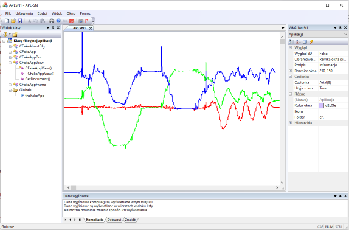

Stacja Naziemna dla roju Wronów z APL3 do zwalczania kóz bojowych (patrz: https://www.youtube.com/shorts/rCg7bQjVZZg) i innych niekonwencjonalnych zagrożeń.

Działają już pierwsze wykresy z telemetrii on-line

