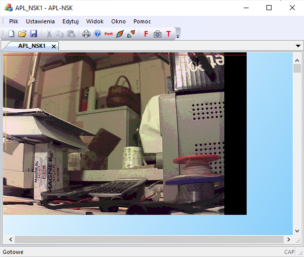

Naziemna Stacja Kontroli do obsługi roju Wronów z APL3 do zwalczania kóz bojowych i innych niekonwencjonalnych zagrożeń. Patrz: https://www.youtube.com/shorts/rCg7bQjVZZg

Działają już pierwsze wykresy z telemetrii on-line

Konfiguracja kamery, zrobiona w ramach rozpoznania możliwosci regulacji obrazu od stroy źródła

Działa przesyłanie obrazu w standardowej ramce komunikacyjnej wysyłanej UART-em. Koszmarnie wolno, ale można przesłać zwykłym radiomodemem.
