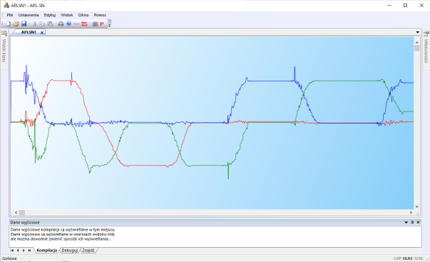

Naziemna Stacja Kontroli do obsługi roju Wronów z APL3 do zwalczania <a href="https://www.youtube.com/shorts/rCg7bQjVZZg" target="_blank">kóz bojowych</a> i innych niekonwencjonalnych zagrożeń. 

Działają już pierwsze wykresy z telemetrii on-line

Konfiguracja kamery, zrobiona w ramach rozpoznania możliwosci regulacji obrazu od strony źródła

Działa przesyłanie obrazu w standardowej ramce komunikacyjnej wysyłanej UART-em. Koszmarnie wolno, ale można przesłać zwykłym radiomodemem.
